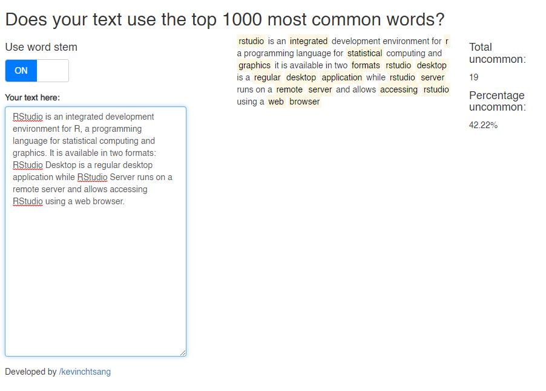

# Common Word Checker
Shiny app to help check if your text uses the top 1000 most common words. Using the most common words is a method of ensuring that you are able to communicate with a wide audience. 

You can use this app on your browser by [clicking here](https://hx2j2u-kevin-tsang.shinyapps.io/common_word_checker/).

You can also use this app locally by running the following in R.

```
install.packages("shiny")
shiny::runGitHub("common-word-checker", "kevinchtsang")
```



## Functions
You can use the toggle to switch between highlighting uncommon words using the stem word or by the actual word. This app makes use of the following packages [`stringr`](https://stringr.tidyverse.org/) [`tokenizers`](https://cran.r-project.org/web/packages/tokenizers/index.html) [`stopwords`](https://cran.r-project.org/web/packages/stopwords/readme/README.html) and [`shinyWidgets`](https://cran.r-project.org/web/packages/shinyWidgets/index.html)

Stopwords (defined by the [`stopwords`](https://cran.r-project.org/web/packages/stopwords/readme/README.html) package) are not highlighted.